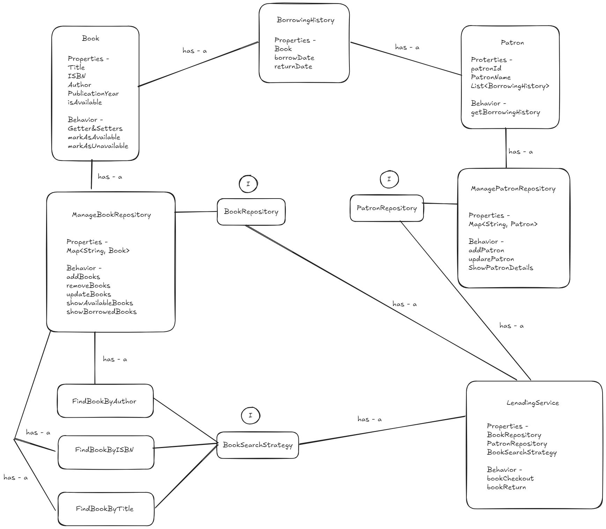

# Library Management System (Java)

This is a simple Library Management System built using Java with proper OOP principles, SOLID design, and common design patterns. It supports book checkout, return, and search functionalities.

---

## 📦 Class Responsibilities

### 🔹 `Book`
Represents a book in the library.
- Attributes: `title`, `author`, `ISBN`, `publicationYear`, `isAvailable`
- Methods: mark as available/unavailable, getters/setters

---

### 🔹 `Patron`
Represents a user/member of the library.
- Attributes: `patronId`, `patronName`, `borrowingHistory`
- Methods: Get/set patron details and borrowing history

---

### 🔹 `BorrowingHistory`
Tracks each borrow/return record.
- Attributes: `book`, `borrowDate`, `returnDate`
- Methods: Set/get dates and associated book

---

### 🔹 `BookRepository` (Interface)
Abstracts storage and retrieval of books.

### 🔹 `ManageBookRepository`
Concrete implementation of `BookRepository`.
- Uses a `Map<String, Book>` to store books by ISBN.

---

### 🔹 `PatronRepository` (Interface)
Abstracts storage and retrieval of patrons.

### 🔹 `ManagePatronRepository`
Concrete implementation of `PatronRepository`.
- Uses a `Map<String, Patron>` to store patrons by ID.

---

### 🔹 `BookSearchStrategy` (Strategy Interface)
Defines search behavior.

### 🔹 `FindBookByISBN`
Search implementation based on ISBN.

### 🔹 `FindBooksByTitle`
Search implementation based on title.

### 🔹 `FindBooksByAuthor`
Search implementation based on author.

---

### 🔹 `LendingService`
Handles business logic for:
- Checking out books
- Returning books
- Validating and updating repositories
- Logging events/errors using `java.util.logging.Logger`

---

## ✅ Design Principles Used

- **OOP Concepts**: Encapsulation, Polymorphism, Abstraction
- **SOLID**: Single Responsibility, Open/Closed, Dependency Inversion
- **Design Patterns**:
    - Strategy: For book search

